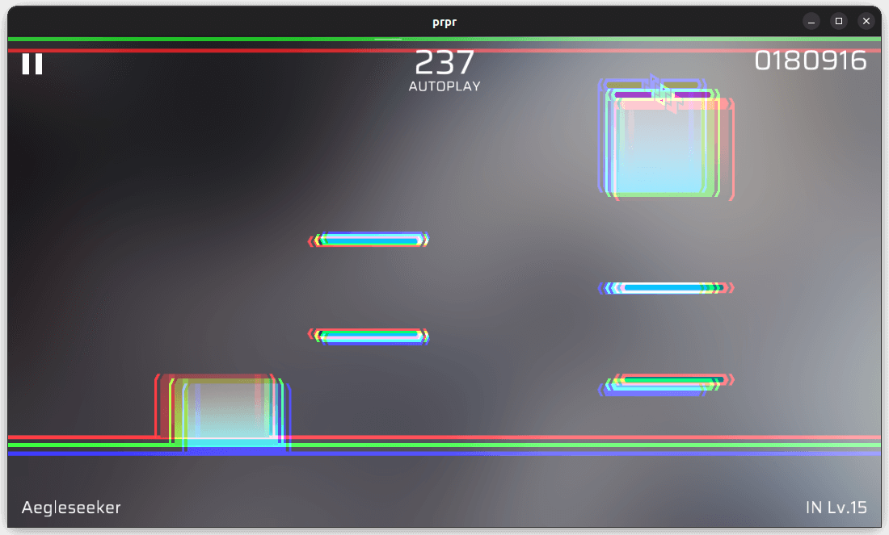

# `chromatic`

Chromatic effect.

## Parameters

-   `sampleCount` (integer, default value: `3`, Range: `1-64`): Sample count, the higher the value, the display will be more coherent, and the overhead will be higher.
-   `power` (float, default value: `0.01`): The intensity, or offset distance.
