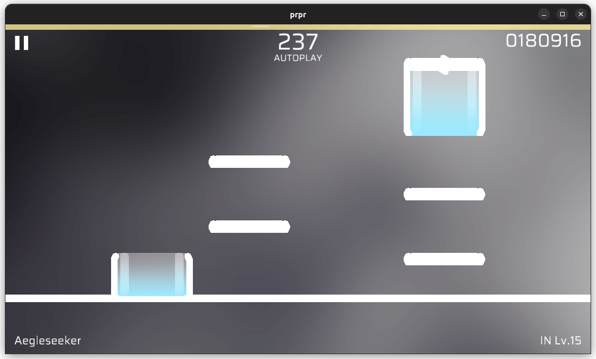

# `circleBlur`

Dot blurring. Will enlarge the pixel blur as highlight, recommended to use with parameter.

## Parameters

-   `size` (float, default value: `10.0`): The size of the origin, in pixels.
