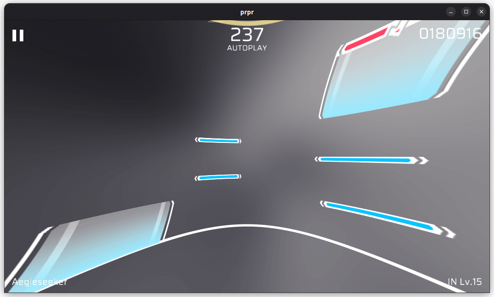
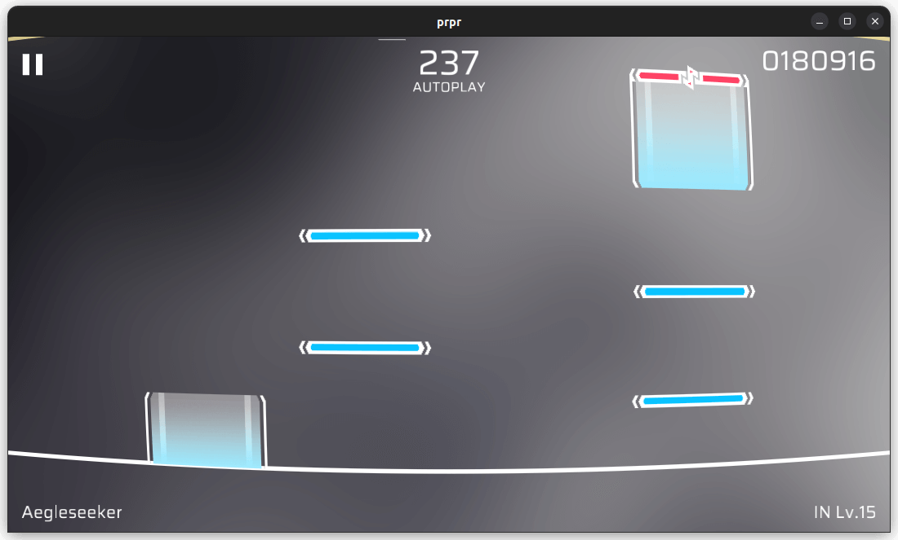

# `fisheye`

Fisheye effect. When `power` is negative, you can make tunneling effect.

`power` as negative value:

`power` as positive value:

## Parameters

-   `power` (float, default value: `-0.1`): Scale of fisheye effect.
