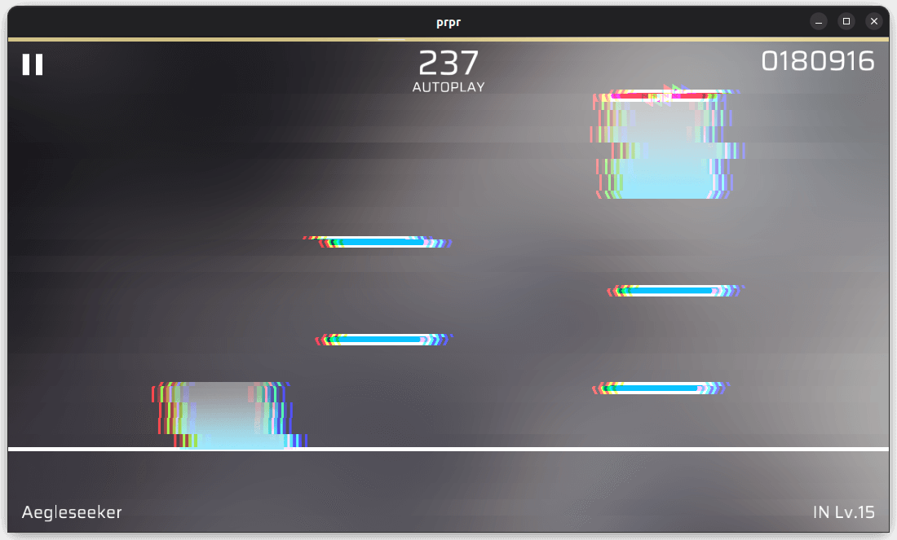

# `glitch`

Confusion/Error effect. The effect produces an indeterminate flicker over time.

## Parameters

-   `power` (float, default value: `0.3`): Flicker intensity.
-   `rate` (float, default value: `0.6`, range: `0-1`): Flicker frequency. `0` for no flickers, `1` for always flicker.
-   `speed` (float, default value: `5.0`): Speed of flickering animation.
-   `blockCount` (float, default value: `30.5`): Look at above images, number of misaligned strips (approximate).
-   `colorRate` (float, default value: `0.01`, range: `0-1`): Distance of color difference.
