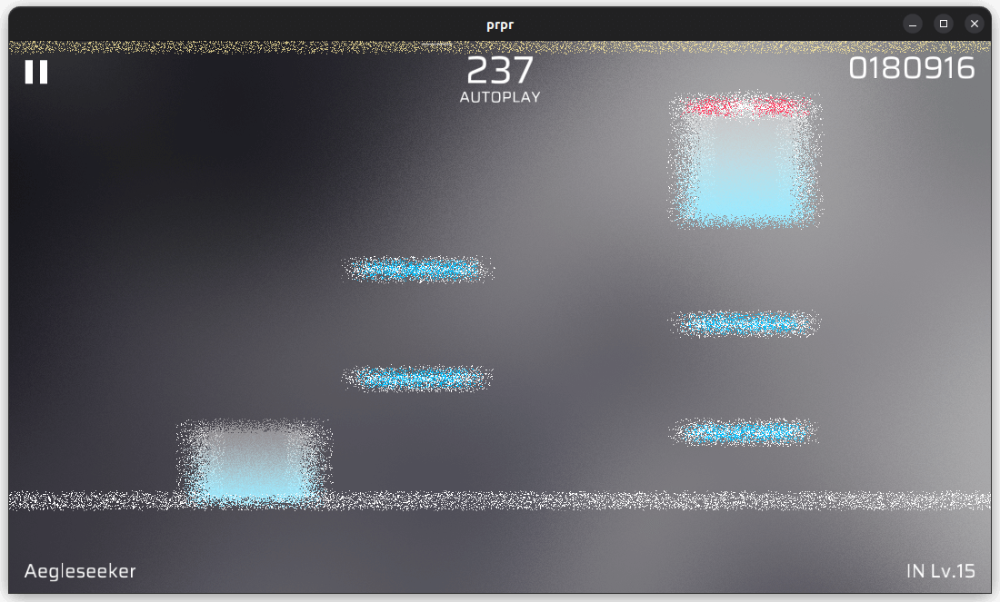

# `noise`

Noise effect. Applies a random layer of blur to the screen.

## Parameters

-   `seed` (float, default value: `81.0`): Used to generate random patterns. By varying the seeds continuously, the pattern can be changed continuously.
-   `power` (float, default value: `0.03`, range: `0-1`): Look at above images, intensity of blur (Range of pixel offset).
