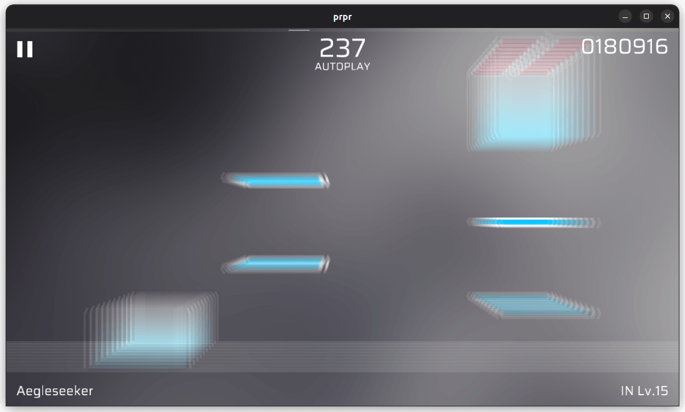

# `radialBlur`

Radial blur.

## Parameters

-   `centerX` (float, default value: `0.5`, range: `0-1`): X coordinate of the effect center.
-   `centerY` (float, default value: `0.5`, range: `0-1`): Y coordinate of the effect center.
-   `power` (float, default value: `0.01`, range: `0-1`): Intensity of effect.
-   `sampleCount` (integer, default value: `3`, range: `1-64`): Sample count, the higher the value, the display will be more coherent, and the overhead will be higher.
