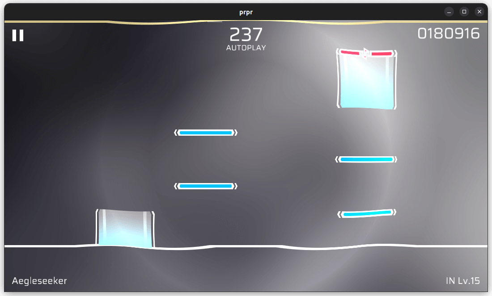

# `shockwave`

Shockwave effect. Recommended to use with `progress` parameter.

## Parameters

-   `progress` (float, default value: `0.2`, range: `0-1`): Progress of the effect. Shockwave is an animation, `0` for start of animation, `1` for end of animation).
-   `centerX` (float, default value: `0.5`, range: `0-1`): X coordinate of the effect center.
-   `centerY` (float, default value: `0.5`, range: `0-1`): Y coordinate of the effect center.
-   `width` (float, default value: `0.1`): Width of the effect.
-   `distortion` (float, default value: `0.8`): Intensity of distortion.
-   `expand` (float, default value: `10.0`): Breadth of expansion.
