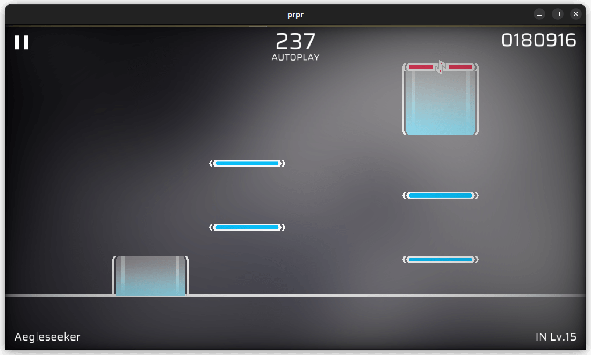

# vignette

Virtual lighting effect. Will darken or tint the edges of the screen to other colors, can be used to simulate some of Arcaea’s anomaly effect.

## Parameters

-   `color`（颜色，默认黑色 \[r, g, b, a\]）：边缘的颜色；
-   `extend` (float, default value: `0.25`, range: `0-1`): The extension from the edge, the larger the value, the more black parts.
-   `radius` (float, default value: `15.0`): Size of central light, the smaller the value, the greater the range affacted.
